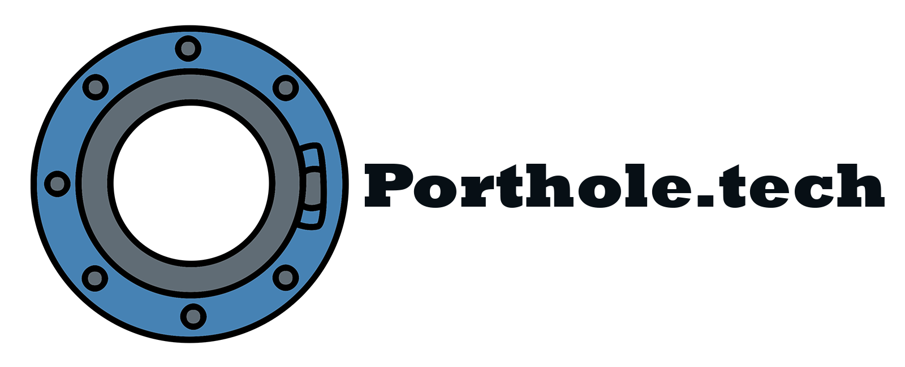

### <p align="center"> </p>

The aim of this project is to immerse users in saved 360 content of places and experiences using modern technology.
We had a collective interest in WebVR and wanted to implement its immensely powerful capabilities to provide a novel experience for our users.

This project uses Vue.js, Vuetify, A-Frame and Leaflet to provide its core functionality.

## Project setup
```
npm install
```

### Compiles and hot-reloads for development
```
npm run serve
```

### Compiles and minifies for production
```
npm run build
```

### Run your tests
```
npm run test
```

### Lints and fixes files
```
npm run lint
```

### Run your end-to-end tests
```
npm run test:e2e
```

### Run your unit tests
```
npm run test:unit
```
